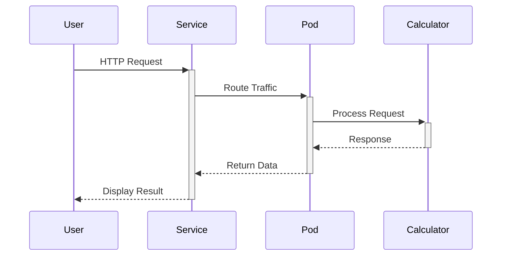

# 📊 Kubernetes Calculator Microservice Deployment


A cloud-native calculator microservice with automated scaling, health monitoring, and zero-downtime deployment capabilities.

## 🌟 Key Features
- **Horizontal Scaling** - Automatically scale calculator pods based on demand
- **Self-Healing** - Automatic pod restarts on failures
- **Service Discovery** - Built-in DNS resolution for microservices
- **Rolling Updates** - Seamless version upgrades with zero downtime
- **Health Monitoring** - Liveness and readiness probes


## 🚀 Deployment Quickstart

### Prerequisites
```bash
# Verify tools
minikube version && kubectl version && docker --version
```

### 1. Initialize Cluster
```bash
minikube start --driver=docker --cpus=2 --memory=4g
minikube addons enable metrics-server  # For HPA
```

### 2. Build & Deploy
```bash
# Set up Docker environment
eval $(minikube docker-env)

# Build optimized image
docker build -t calculator:v1.0.0 .

# Deploy with Kubernetes
kubectl apply -f k8s/
```

### 3. Access the Service
```bash
minikube service calculator-service --url
# Or port-forward for development:
kubectl port-forward svc/calculator-service 8080:80
```

## 📂 Configuration Files

### `deployment.yaml`
```yaml
apiVersion: apps/v1
kind: Deployment
metadata:
  name: calculator
spec:
  replicas: 1
  selector:
    matchLabels:
      app: calculator
  template:
    metadata:
      labels:
        app: calculator
    spec:
      containers:
      - name: calculator
        image: my-node-app:latest  # Pre-built image
        imagePullPolicy: Never     # For local development
        ports:
        - containerPort: 3000
        livenessProbe:            # Healthcheck replacement
          httpGet:
            path: /add?num1=1&num2=1
            port: 3000
          initialDelaySeconds: 5
          periodSeconds: 30
          timeoutSeconds: 10
          failureThreshold: 3
      restartPolicy: Always       # Kubernetes equivalent
```

### `service.yaml`
```yaml
apiVersion: v1
kind: Service
metadata:
  name: node-app-service
spec:
  type: NodePort
  selector:
    app: calculator   
  ports:
    - port: 80
      targetPort: 3000
      nodePort: 31000
```

## 🛠️ Operational Commands

| Task | Command |
|------|---------|
| View pods | `kubectl get pods -o wide` |
| Check logs | `kubectl logs -f <pod-name> --tail=50` |
| Monitor resources | `kubectl top pods` |
| Scale deployment | `kubectl scale deploy/calculator --replicas=5` |
| Service details | `kubectl describe svc calculator-service` |

## 📈 Performance Metrics
```bash
watch -n 2 'kubectl get hpa,deploy,pods,svc'
```

## 🧪 Testing Endpoints

```http
GET /add?num1=23&num2=19
GET /health
GET /metrics
```

## 🌐 Access Patterns


## 📚 Documentation
- [Kubernetes Concepts](https://kubernetes.io/docs/concepts/)
- [Minikube Guide](https://minikube.sigs.k8s.io/docs/)
- [Express Best Practices](https://expressjs.com/en/advanced/best-practice-performance.html)

## 👨‍💻 Author
**Muhammad Nouman Qaiser**
