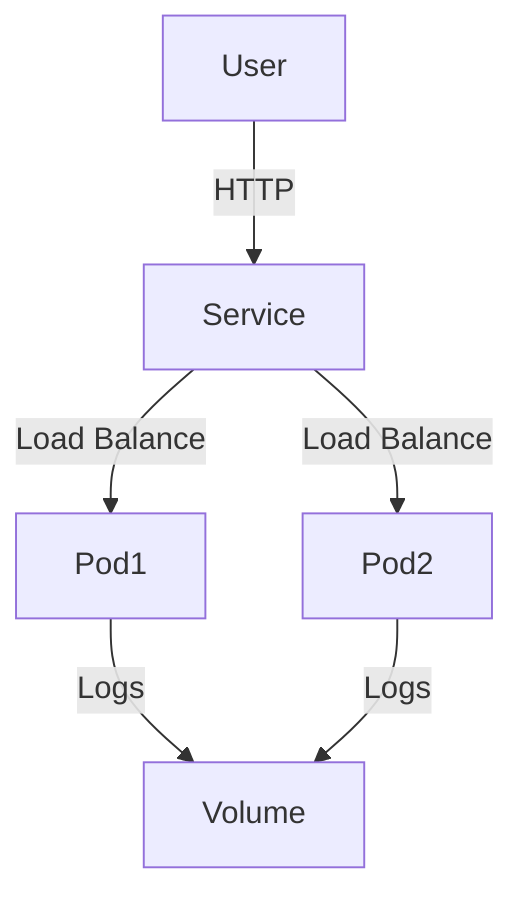

# 📊 Kubernetes Calculator Microservice Deployment


A cloud-native calculator API with full Kubernetes orchestration supporting 6 mathematical operations.

## 🌟 Key Features
- **Zero-Downtime Deployments** - Rolling updates with `maxUnavailable: 0`
- **Self-Healing** - Automatic pod restarts via liveness probes
- **Logging** - Winston logging to `logs/` directory
- **Input Validation** - NaN and division-by-zero protection
- **Resource Efficiency** - 128MB memory limit per pod

## 🚀 Deployment Quickstart

### Prerequisites
```bash
minikube version && kubectl version && docker --version
```

### 1. Initialize Minikube
```bash
minikube start --driver=docker --cpus=2 --memory=4g
minikube docker-env | Invoke-Expression  # PowerShell
```

### 2. Build & Deploy
```bash
# Build image
docker build -t calculator-app:v2 .

# Deploy
kubectl apply -f deployment.yaml
kubectl apply -f service.yaml
```

### 3. Access Service
```powershell
minikube service calculator-service --url
# Alternative:
kubectl port-forward svc/calculator-service 8080:80
```
Access: `http://localhost:8080/add?num1=5&num2=3`

## 📂 Configuration Files

### `deployment.yaml`
```yaml
apiVersion: apps/v1
kind: Deployment
metadata:
  name: calculator
spec:
  replicas: 2
  selector:
    matchLabels:
      app: calculator
  strategy:
    rollingUpdate:
      maxSurge: 1
      maxUnavailable: 0
  template:
    metadata:
      labels:
        app: calculator
    spec:
      containers:
      - name: calculator
        image: calculator-app:v2
        ports:
        - containerPort: 3000
        resources:
          limits:
            cpu: "500m"
            memory: "128Mi"
        livenessProbe:
          httpGet:
            path: /
            port: 3000
          initialDelaySeconds: 15
```

### `service.yaml`
```yaml
apiVersion: v1
kind: Service
metadata:
  name: calculator-service
spec:
  type: NodePort
  ports:
  - port: 80
    targetPort: 3000
    nodePort: 31000
  selector:
    app: calculator
```

## 🛠️ Operational Commands

| Task | Command |
|------|---------|
| Check pods | `kubectl get pods -w` |
| View logs | `kubectl logs -f <pod-name>` |
| Debug service | `kubectl describe svc calculator-service` |
| Scale pods | `kubectl scale deploy/calculator --replicas=3` |
| Delete all | `kubectl delete -f deployment.yaml -f service.yaml` |

## 🧪 Available Endpoints
```http
GET /add?num1={x}&num2={y}
GET /subtract?num1={x}&num2={y} 
GET /multiply?num1={x}&num2={y}
GET /divide?num1={x}&num2={y}
GET /sqrt?num={x}
GET /modulo?num1={x}&num2={y}
```

## 📊 Architecture


## 📚 Documentation
- [Kubernetes Probes](https://kubernetes.io/docs/tasks/configure-pod-container/configure-liveness-readiness-startup-probes/)
- [Express Error Handling](https://expressjs.com/en/guide/error-handling.html)
- [Winston Logging](https://github.com/winstonjs/winston)

## 👨‍💻 Author
**Muhammad Nouman Qaiser**  
[GitHub Repository](https://github.com/M-NOUMAN-QAISER/sit737-2025-prac6p)